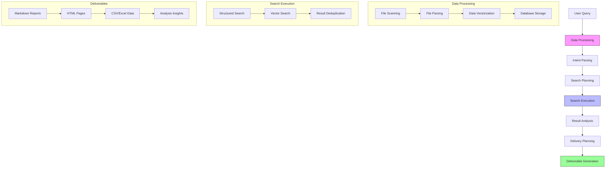

# DataMind


## Your AI-Powered Document Intelligence Assistant

[](./LICENSE)
[](https://www.python.org)
[](https://github.com/helixlife-ai/datamind/releases)

[English](README.md) | [中文](docs/README_zh.md)

## 📖 Introduction

DataMind is your intelligent document assistant that transforms how you interact with your knowledge base. Powered by DeepSeek R1, a state-of-the-art reasoning model, it understands your documents at a deep semantic level and generates insights with remarkable accuracy.

Think of DataMind as your knowledge alchemy cauldron - simply toss in your documents, data, and files, express what you need, and watch as it automatically distills them into valuable deliverables. Like a master alchemist, it:
- Transforms raw documents into refined knowledge
- Extracts golden insights from information ore
- Synthesizes scattered facts into coherent wisdom
- Crystallizes complex data into clear understanding

For example:
- Need a market analysis? Throw in industry reports, news articles, and data sheets - get a comprehensive market landscape report
- Building technical documentation? Add your codebase, API docs, and user feedback - receive a well-structured technical manual
- Researching competitors? Input competitor websites, product docs, and social media data - obtain detailed competitive analysis
- Planning a project? Include past project files, team discussions, and requirements docs - get an organized project blueprint

Put your documents in, state your needs, and let DataMind's AI alchemy work its magic to deliver exactly what you're looking for.

Think of it as having a dedicated research assistant who:
- Thoroughly understands your document collection using advanced AI reasoning
- Intelligently processes your natural language requests
- Automatically generates professional reports and insights
- Delivers results in your preferred format
- Maintains logical coherence and factual accuracy through AI-powered reasoning

### 🎯 Key Applications

- **AI-Powered Research & Analysis**
  * Generate comprehensive research reports with deep semantic understanding
  * Extract insights and patterns through advanced reasoning
  * Create timeline-based analysis with logical connections
  * Ensure factual accuracy through AI verification

- **Knowledge Base Intelligence**
  * Transform static document repositories into interactive knowledge bases
  * Get instant, context-aware answers from your documentation
  * Generate structured summaries and insights from unstructured content

- **Smart Content Delivery**
  * Automatically generate reports in multiple formats (Markdown, HTML, PDF)
  * Create custom deliverables based on specific requirements
  * Maintain source traceability with automatic reference management

- **Document Analytics**
  * Analyze document relationships and knowledge graphs
  * Track content evolution and updates over time
  * Generate statistical insights about your knowledge base

- **Enterprise Documentation**
  * Streamline technical documentation workflows
  * Generate consistent documentation from various sources
  * Maintain living documents that evolve with your content

## System Architecture

The following diagram illustrates the workflow of the system:



## ✨ Core Features

### 🔄 Intelligent Document Processing
- **Multi-format Support**: Handles JSON, CSV, Excel, XML, TXT, Markdown, etc.
- **Smart Parsing**: Auto-detects file encoding and type, extracts document structure
- **Vector Processing**: Multi-language text vectorization based on Sentence-Transformers
- **Unified Storage**: Efficient storage of structured data and vector representations using DuckDB
- **Incremental Updates**: Supports incremental document processing for improved efficiency

### 🔍 Hybrid Search Engine
- **Semantic Search**: High-performance vector similarity search based on FAISS
- **Structured Queries**: Supports exact matching and condition filtering
- **Hybrid Ranking**: Intelligent fusion of vector similarity and structured query results
- **Aggregation Analysis**: Supports multi-dimensional data analysis and visualization
- **Smart Caching**: File processing cache mechanism for improved retrieval performance

### 🎨 New Features (v0.2.2)
- **Intelligent Search Pipeline**: 
  * Enhanced search planning and execution workflow
  * Improved query intent parsing and understanding
  * Smart delivery plan generation
  * Customizable result formatting
- **Intelligent Delivery System**:
  * Advanced delivery planning with DeliveryPlanner
  * Automated content organization and structuring
  * Smart template selection and adaptation
  * Context-aware content generation
- **Document Analysis**: 
  * Advanced document structure analysis
  * Multi-dimensional data insights
  * Automated report generation
  * Timeline-based content organization
- **Result Processing**:
  * Flexible result saving mechanisms
  * Multiple output format support (Markdown, CSV, JSON)
  * Enhanced result formatting and presentation
  * Customizable delivery templates
- **System Optimization**:
  * Improved error handling and recovery
  * Enhanced logging and monitoring
  * Better resource management
  * Optimized cache utilization

## 🚀 Quick Start

### Installation

```bash
# Clone the project
git clone https://github.com/helixlife-ai/datamind.git
cd datamind

# Install dependencies
pip install -r requirements.txt

# Generate test data
python scripts/generate_test_data.py
```

### Test Data Description

Generated test data includes AI-related documents in various formats:
- `ai_guide.md`: AI basics introduction
- `ai_models.json`: Mainstream AI model information
- `ml_algorithms.csv`: Machine learning algorithm comparison
- `ai_applications.xml`: AI application domain data
- `ai_companies.xlsx`: AI company information

### Usage Example

The easiest way to get started is to run the example script:

```bash
# Run the example script
python examples/example_usage.py
```

This script demonstrates:
- Data processing with incremental updates
- Basic search functionality with various query types
- Intelligent search with query intent parsing
- Delivery plan generation and execution
- Multi-format result export

For more detailed examples, check out the `examples` directory.

### Work Directory Structure

After running the example script, the following directory structure will be created:

```
work_dir/
├── test_data/              # Test data directory
│   ├── ai_guide.md
│   ├── ai_models.json
│   └── ...
├── test_queries.txt        # Example search queries
├── context.txt            # Search context information
└── output/
    └── intelligent_search/
        └── delivery_plans/
            └── plan_[timestamp]/
                ├── plan.json         # Delivery plan configuration
                ├── search_results/   # Raw search results
                │   ├── results.json
                │   ├── results.html
                │   ├── results.csv
                │   └── results.xlsx
                └── deliverables/     # Generated deliverables
                    ├── report.md     # Main report
                    ├── insights.md   # Key insights
                    ├── timeline.md   # Timeline analysis
                    └── references.md # Source references

data/                      # Data storage
├── unified_storage.duckdb # Vector database
└── file_cache.pkl        # File processing cache
```

### Generated Deliverables

The system generates several types of deliverables:

1. Search Results:
   - JSON format: Complete structured data
   - HTML format: Interactive web view
   - CSV/Excel: Tabular data for analysis
   - Timeline view: Time-based visualization

2. Analysis Reports:
   - Main report: Comprehensive analysis
   - Key insights: Important findings
   - Timeline analysis: Time-based patterns
   - Source references: Original document links

3. Metadata:
   - Delivery plan configuration
   - Search statistics
   - Processing metrics
   - Cache information

### Example Features

1. Basic Search:
   - Content-based search: "machine learning", "artificial intelligence"
   - File type search: "file:json", "file:markdown"
   - Field search: "company:OpenAI", "author:Zhang"
   - Date filters: "modified:>2024-01-01"

2. Intelligent Search:
   - Natural language queries
   - Automatic query intent parsing
   - Smart search plan generation
   - Context-aware result organization

3. Result Delivery:
   - Multiple output formats (JSON, HTML, CSV, Excel)
   - Customizable report templates
   - Automated insight generation
   - Source reference management

## ⚙️ Configuration

### Environment Variables

The project uses environment variables for configuration. You can set them up in two ways:

1. Using `.env` file (recommended):
   ```bash
   cp .env.example .env
   # Then edit .env with your values
   ```

2. Setting directly in environment:
   ```bash
   export DATAMIND_LLM_API_KEY=your-api-key-here
   export DATAMIND_LLM_API_BASE=https://api.deepseek.com
   ```

Available environment variables:

1. LLM API Configuration:
   ```bash
   # Deepseek API (Required)
   DATAMIND_LLM_API_KEY=your-deepseek-api-key-here
   DATAMIND_LLM_API_BASE=https://api.deepseek.com

   # SiliconFlow API (Optional)
   DATAMIND_SILICONFLOW_API_KEY=your-siliconflow-api-key-here
   DATAMIND_SILICONFLOW_API_BASE=https://api.siliconflow.cn/v1
   ```

2. Storage Configuration:
   ```bash
   # Database and cache paths
   DATAMIND_DB_PATH=data/unified_storage.duckdb
   DATAMIND_CACHE_PATH=data/file_cache.pkl
   ```

3. Directory Configuration:
   ```bash
   # Working directories
   DATAMIND_WORK_DIR=work_dir
   DATAMIND_OUTPUT_DIR=work_dir/output
   ```

### System Settings

The system settings are managed in `datamind/config/settings.py`. Key configurations include:

1. Model Settings:
   ```python
   # Embedding model
   DEFAULT_EMBEDDING_MODEL = 'paraphrase-multilingual-MiniLM-L12-v2'
   
   # LLM models
   DEFAULT_LLM_MODEL = "Pro/deepseek-ai/DeepSeek-V3"    
   DEFAULT_CHAT_MODEL = "Pro/deepseek-ai/DeepSeek-V3" 
   DEFAULT_REASONING_MODEL = "Pro/deepseek-ai/DeepSeek-R1" 
   ```

2. Search Parameters:
   ```python
   # Search configuration
   SEARCH_TOP_K = 5
   DEFAULT_SIMILARITY_THRESHOLD = 0.6
   DEFAULT_TARGET_FIELD = "abstract_embedding"
   ```

3. File Support:
   ```python
   # Supported file types
   SUPPORTED_FILE_TYPES = [
       "txt", "pdf", "doc", "docx", 
       "md", "json", "csv", "xlsx"
   ]
   ```

4. Query Templates:
   - Structured query templates for different search types
   - Prompt templates for intent parsing
   - Reference text extraction templates

You can customize these settings by modifying the settings file or overriding them through environment variables.

## 📊 Performance Metrics

- Document Processing Speed: ~150 docs/sec (standard configuration)
- Vector Search Latency: <30ms (million-scale data)
- Document Scale Support: Million-level (16GB RAM)
- Vector Dimensions: 384 (using MiniLM model)
- Cache Hit Rate: >90% (normal usage)

## 🗺️ Roadmap

- [x] Incremental Update Support
- [x] File Caching Mechanism
- [ ] Web Interface Support
- [ ] REST API Interface
- [ ] Distributed Processing Support
- [ ] Real-time Processing Pipeline
- [ ] More File Format Support

## 🤝 Contributing

PRs and Issues welcome! See [Contributing Guide](CONTRIBUTING.md) for details.

## 📄 License

This project is under MIT License - see [LICENSE](LICENSE) file

## 👥 Team

- Author: [jszhang]
- Email: zhangjingsong@helixlife.cn
- Team: [HelixLife AI Research Institute](https://github.com/helixlife-ai)
- Team Homepage: https://github.com/helixlife-ai

## 🙏 Acknowledgments

Thanks to these open source projects:
- [Sentence-Transformers](https://github.com/UKPLab/sentence-transformers)
- [FAISS](https://github.com/facebookresearch/faiss)
- [DuckDB](https://github.com/duckdb/duckdb)

## 环境变量配置

项目使用以下环境变量：

- `DATAMIND_LLM_API_KEY`: (必需) LLM API密钥
- `DATAMIND_LLM_API_BASE`: (可选) LLM API基础URL，默认为 "https://api.deepseek.com"

你可以通过以下方式设置环境变量：

1. 创建 `.env` 文件：
   ```bash
   cp .env.example .env
   # 然后编辑 .env 文件填入实际的值
   ```

2. 或者直接在环境中设置：
   ```bash
   export DATAMIND_LLM_API_KEY=your-api-key-here
   export DATAMIND_LLM_API_BASE=https://api.deepseek.com
   ```

## 项目结构

```
datamind/
├── api/              # 对外接口层
├── core/             # 核心功能实现
├── config/           # 配置文件
├── models/           # 模型定义
├── services/         # 业务逻辑层
└── utils/            # 工具函数

data/                 # 数据文件存储
├── unified_storage.duckdb
└── file_cache.pkl

docs/                 # 文档
examples/             # 示例代码
├── example_usage.py
└── ...

tests/               # 测试文件
work_dir/            # 工作目录
scripts/             # 脚本文件
model_cache/         # 模型缓存
```
