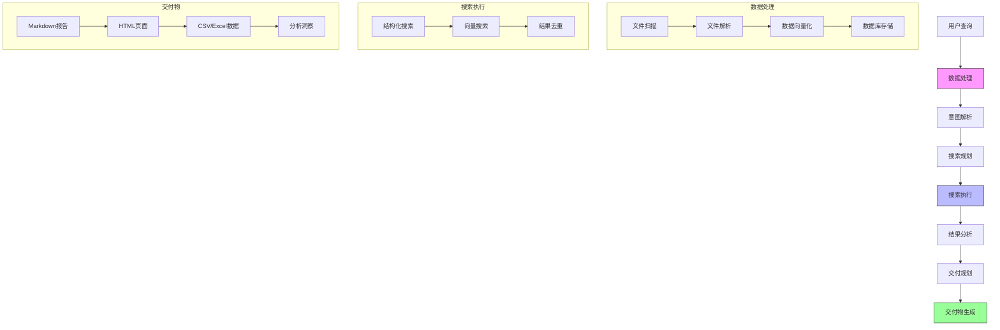

# DataMind


## 您的 AI 文档智能助手

[](LICENSE)
[](https://www.python.org)
[](https://github.com/helixlife-ai/datamind/releases)

[English](README.md) | [中文](docs/README_zh.md)

## 📖 简介

DataMind 是您的智能文档助手，它彻底改变了您与知识库交互的方式。基于 DeepSeek R1 最先进的推理大模型，它能够在深层语义层面理解您的文档，并以卓越的准确性生成洞察。

**Data in, Surprise out!**

把 DataMind 想象成一座智慧的知识炼丹炉 —— 只需将您的文档、数据和文件投入其中，说出您的需求，就能看着它自动将这些原料提炼成珍贵的交付物。如同一位炼丹大师，它能：
- 将原始文档转化为精炼知识
- 从信息矿藏中提取金色洞见
- 将散落的事实融合成连贯智慧
- 把复杂数据结晶为清晰理解

## 🚀 应用场景

DataMind 可以在多种场景中发挥强大作用：

- **市场分析**：投入行业报告、新闻文章和数据表 —— 获得全面的市场格局报告
- **技术文档**：添加代码库、API文档和用户反馈 —— 收获结构完整的技术手册
- **竞争对手研究**：输入竞品网站、产品文档和社交媒体数据 —— 得到详实的竞争分析
- **项目规划**：放入历史项目文件、团队讨论和需求文档 —— 获取有条理的项目蓝图

## ✨ 核心特性

### 🔄 智能文档处理
- **多格式支持**: 自动处理 JSON、CSV、Excel、XML、TXT、Markdown、PDF、Word 等格式
- **智能解析**: 自动识别文件编码和类型，提取文档结构
- **向量化处理**: 基于 Sentence-Transformers 的多语言文本向量化
- **统一存储**: 采用 DuckDB 高效存储结构化数据和向量表示
- **增量更新**: 支持文档增量处理，提高处理效率

### 🔍 混合搜索引擎
- **语义搜索**: 基于 FAISS 的高性能向量相似度检索
- **结构化查询**: 支持精确匹配和条件过滤
- **混合排序**: 智能融合向量相似度和结构化查询结果
- **聚合分析**: 支持多维度数据分析和可视化
- **智能缓存**: 文件处理缓存机制，提升检索性能

### 🧠 AI 推理引擎
- **深度理解**: 基于 DeepSeek R1 的深度语义理解
- **多步推理**: 支持复杂问题的分解和多步骤推理
- **事实验证**: 基于文档内容的事实核查和验证
- **上下文感知**: 保持对话上下文的连贯性和一致性
- **多语言支持**: 支持中英文等多种语言的理解和生成

### 📊 智能交付
- **格式多样化**: 支持 Markdown、HTML、CSV、Excel 等多种输出格式
- **自动排版**: 智能生成结构化报告和文档
- **数据可视化**: 自动生成图表和可视化内容
- **交互式输出**: 支持交互式探索和分析
- **定制化模板**: 支持用户自定义输出模板

## 🔧 系统架构

以下图表展示了系统的工作流程：



## 🛠️ 快速开始

### 安装

```bash
# 克隆仓库
git clone https://github.com/helixlife-ai/datamind.git
cd datamind

# 安装依赖
pip install -r requirements.txt

# 设置环境变量
cp .env.example .env
# 编辑 .env 文件，填入您的 API 密钥
```

### 基本使用

```python
from datamind import DataMind

# 初始化 DataMind
dm = DataMind(work_dir="my_project")

# 添加文档
dm.add_documents("path/to/documents")

# 提问并获取回答
response = dm.ask("分析这些文档中的主要趋势是什么？")
print(response)

# 生成报告
report = dm.generate_report(
    title="市场趋势分析",
    sections=["市场概况", "竞争分析", "发展趋势", "机会与挑战"]
)
dm.save_report(report, "market_analysis.md")
```

## ⚙️ 配置指南

### 环境变量

项目使用以下环境变量：

- `DATAMIND_LLM_API_KEY`: (必需) LLM API密钥
- `DATAMIND_LLM_API_BASE`: (可选) LLM API基础URL，默认为 "https://api.deepseek.com"
- `DATAMIND_DB_PATH`: (可选) 数据库存储路径
- `DATAMIND_CACHE_PATH`: (可选) 文件缓存路径
- `DATAMIND_WORK_DIR`: (可选) 工作目录
- `DATAMIND_OUTPUT_DIR`: (可选) 输出目录

你可以通过以下方式设置环境变量：

1. 创建 `.env` 文件：
   ```bash
   cp .env.example .env
   # 然后编辑 .env 文件填入实际的值
   ```

2. 或者直接在环境中设置：
   ```bash
   export DATAMIND_LLM_API_KEY=your-api-key-here
   export DATAMIND_LLM_API_BASE=https://api.deepseek.com
   ```

### 系统设置

系统设置在 `datamind/config/settings.py` 中管理。主要配置包括：

1. 模型设置：
   ```python
   # 嵌入模型
   DEFAULT_EMBEDDING_MODEL = 'paraphrase-multilingual-MiniLM-L12-v2'
   
   # LLM 模型
   DEFAULT_LLM_MODEL = "Pro/deepseek-ai/DeepSeek-V3"    
   DEFAULT_CHAT_MODEL = "Pro/deepseek-ai/DeepSeek-V3" 
   DEFAULT_REASONING_MODEL = "Pro/deepseek-ai/DeepSeek-R1" 
   ```

2. 搜索参数：
   ```python
   # 搜索配置
   SEARCH_TOP_K = 5
   DEFAULT_SIMILARITY_THRESHOLD = 0.6
   DEFAULT_TARGET_FIELD = "abstract_embedding"
   ```

3. 文件支持：
   ```python
   # 支持的文件类型
   SUPPORTED_FILE_TYPES = [
       "txt", "pdf", "doc", "docx", 
       "md", "json", "csv", "xlsx"
   ]
   ```

4. 查询模板：
   - 不同搜索类型的结构化查询模板
   - 意图解析的提示词模板
   - 参考文本提取模板

你可以通过修改设置文件或通过环境变量覆盖这些设置。

## 📊 性能指标

- 文档处理速度：~150 文档/秒（标准配置）
- 向量检索延迟：<30ms（百万级数据规模）
- 支持文档规模：百万级（16GB 内存配置）
- 向量维度：384（使用 MiniLM 模型）
- 缓存命中率：>90%（正常使用场景）

## 📁 项目结构 