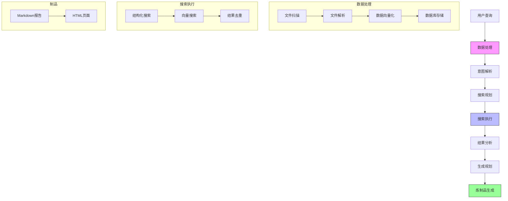

# DataMind


## 您的 AI 文档智能助手

[](../LICENSE)
[](https://www.python.org)
[](https://github.com/helixlife-ai/datamind/releases)

[English](../README.md) | [中文](README_zh.md)

## 📖 简介

DataMind 是您的智能文档助手，它彻底改变了您与知识库交互的方式。基于最先进的大语言模型，它能够在深层语义层面理解您的文档，并以卓越的准确性生成洞察。

**Data in, Surprise out!**

把 DataMind 想象成一座智慧的知识炼丹炉 —— 只需将您的文档、数据和文件投入其中，说出您的需求，就能看着它自动将这些原料提炼成珍贵的交付物。如同一位炼丹大师，它能：
- 将原始文档转化为精炼知识
- 从信息矿藏中提取金色洞见
- 将散落的事实融合成连贯智慧
- 把复杂数据结晶为清晰理解

举几个例子：
- 需要市场分析？投入行业报告、新闻文章和数据表 —— 获得全面的市场格局报告
- 构建技术文档？添加代码库、API文档和用户反馈 —— 收获结构完整的技术手册
- 研究竞争对手？输入竞品网站、产品文档和社交媒体数据 —— 得到详实的竞争分析
- 规划项目？放入历史项目文件、团队讨论和需求文档 —— 获取有条理的项目蓝图

放入您的文档，说出您的需求，让 DataMind 的 AI 炼金术为您变出完美的炼制品。

把它想象成您的专属研究助手：
- 运用先进的 AI 推理深入理解您的文档集合
- 智能处理您的自然语言请求
- 自动生成专业的报告和洞察
- 以您偏好的格式交付结果
- 通过 AI 推理保持逻辑连贯性和事实准确性

## 功能演示

[功能演示视频](https://www.bilibili.com/video/123456/)

## 系统架构

以下图表展示了系统的工作流程：



## ✨ 核心特性

### 🔄 智能文档处理
- **多格式支持**: 自动处理 JSON、CSV、Excel、XML、TXT、Markdown 等格式
- **智能解析**: 自动识别文件编码和类型，提取文档结构
- **向量化处理**: 基于 Sentence-Transformers 的多语言文本向量化
- **统一存储**: 采用 DuckDB 高效存储结构化数据和向量表示
- **增量更新**: 支持文档增量处理，提高处理效率

### 🔍 混合搜索引擎
- **语义搜索**: 基于 FAISS 的高性能向量相似度检索
- **结构化查询**: 支持精确匹配和条件过滤
- **混合排序**: 智能融合向量相似度和结构化查询结果
- **聚合分析**: 支持多维度数据分析和可视化
- **智能缓存**: 文件处理缓存机制，提升检索性能

### 📝 神奇制品生成
- **智能排版**: 自动优化文档结构，提升可读性
- **源引用管理**: 自动提取和引用原始文档
- **HTML炼制品**: 以 HTML 格式输出炼制品

### 🔄 自动迭代
- **自动迭代**: 根据用户反馈自动迭代新的炼制品
- **人工介入**: 用户可以在炼制过程中介入，提供反馈和增加新文档，调整炼制方向

### 🎨 新增特性 (v0.3.0)
- 新增 app 入口，实现基于 web 的交互

## 🚀 快速开始

### 安装

```bash
# Clone the project
git clone https://github.com/helixlife-ai/datamind.git
cd datamind

# Install dependencies
pip install -r requirements.txt
playwright install chromium

# Generate test data
python scripts/generate_test_data.py
```

### 使用示例

运行示例脚本是最简单的开始方式：

```bash
# Run the app
cd app
pnpm install
node server.js
```
浏览器打开：http://localhost:3000
将要处理的本地文档放在work_dir目录下，点击开始运行按钮。

## ⚙️ 配置

### 环境变量

项目使用环境变量进行配置。你可以通过以下两种方式设置：

1. 使用 `.env` 文件（推荐）：
   ```bash
   cp .env.example .env
   # 然后编辑 .env 文件填入你的值
   ```

2. 直接在环境中设置：
   ```bash
   DEFAULT_API_KEY=["your-api-key-here"]
   DEFAULT_BASE_URL=https://api.siliconflow.cn/v1
   DEFAULT_GENERATOR_MODEL="Pro/deepseek-ai/DeepSeek-V3"
   DEFAULT_REASONING_MODEL="Pro/deepseek-ai/DeepSeek-R1"
   ```

## 🤝 参与贡献

欢迎提交 PR 或 Issue！详细信息请参考 [贡献指南](CONTRIBUTING.md)。

## 📄 开源协议

本项目采用 MIT 协议 - 详见 [LICENSE](LICENSE) 文件

## 👥 团队

- 作者：静松
- 微信：imjszhang
- 邮箱：zhangjingsong@helixlife.cn
- 团队：[Helixlife AI Lab](https://github.com/helixlife-ai)

## 🙏 致谢

感谢以下开源项目：
- [Sentence-Transformers](https://github.com/UKPLab/sentence-transformers)
- [FAISS](https://github.com/facebookresearch/faiss)
- [DuckDB](https://github.com/duckdb/duckdb)
