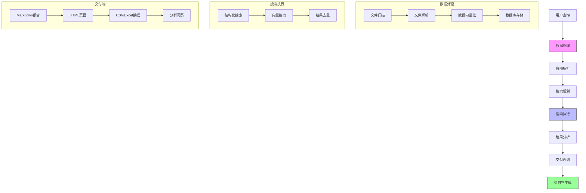

# DataMind


## 您的 AI 文档智能助手

[](../LICENSE)
[](https://www.python.org)
[](https://github.com/helixlife-ai/datamind/releases)

[English](../README.md) | [中文](README_zh.md)

## 📖 简介

DataMind 是您的智能文档助手，它彻底改变了您与知识库交互的方式。基于 DeepSeek R1 最先进的推理大模型，它能够在深层语义层面理解您的文档，并以卓越的准确性生成洞察。

**Data in, Surprise out!**

把 DataMind 想象成一座智慧的知识炼丹炉 —— 只需将您的文档、数据和文件投入其中，说出您的需求，就能看着它自动将这些原料提炼成珍贵的交付物。如同一位炼丹大师，它能：
- 将原始文档转化为精炼知识
- 从信息矿藏中提取金色洞见
- 将散落的事实融合成连贯智慧
- 把复杂数据结晶为清晰理解

举几个例子：
- 需要市场分析？投入行业报告、新闻文章和数据表 —— 获得全面的市场格局报告
- 构建技术文档？添加代码库、API文档和用户反馈 —— 收获结构完整的技术手册
- 研究竞争对手？输入竞品网站、产品文档和社交媒体数据 —— 得到详实的竞争分析
- 规划项目？放入历史项目文件、团队讨论和需求文档 —— 获取有条理的项目蓝图

放入您的文档，说出您的需求，让 DataMind 的 AI 炼金术为您变出完美的交付物。

把它想象成您的专属研究助手：
- 运用先进的 AI 推理深入理解您的文档集合
- 智能处理您的自然语言请求
- 自动生成专业的报告和洞察
- 以您偏好的格式交付结果
- 通过 AI 推理保持逻辑连贯性和事实准确性

## 系统架构

以下图表展示了系统的工作流程：



## ✨ 核心特性

### 🔄 智能文档处理
- **多格式支持**: 自动处理 JSON、CSV、Excel、XML、TXT、Markdown 等格式
- **智能解析**: 自动识别文件编码和类型，提取文档结构
- **向量化处理**: 基于 Sentence-Transformers 的多语言文本向量化
- **统一存储**: 采用 DuckDB 高效存储结构化数据和向量表示
- **增量更新**: 支持文档增量处理，提高处理效率

### 🔍 混合搜索引擎
- **语义搜索**: 基于 FAISS 的高性能向量相似度检索
- **结构化查询**: 支持精确匹配和条件过滤
- **混合排序**: 智能融合向量相似度和结构化查询结果
- **聚合分析**: 支持多维度数据分析和可视化
- **智能缓存**: 文件处理缓存机制，提升检索性能

### 🎨 新增特性 (v0.2.2)
- **智能搜索流程**: 
  * 增强的搜索规划和执行流程
  * 改进的查询意图解析和理解
  * 智能交付计划生成
  * 可定制的结果格式化
- **智能交付系统**:
  * 基于 DeliveryPlanner 的高级交付规划
  * 自动化内容组织和结构化
  * 智能模板选择和适配
  * 上下文感知的内容生成
- **文档分析**: 
  * 高级文档结构分析
  * 多维度数据洞察
  * 自动化报告生成
  * 基于时间线的内容组织
- **结果处理**:
  * 灵活的结果保存机制
  * 多格式输出支持（Markdown、CSV、JSON）
  * 增强的结果格式化和展示
  * 可定制的交付模板
- **系统优化**:
  * 改进的错误处理和恢复
  * 增强的日志和监控
  * 更好的资源管理
  * 优化的缓存利用

## 🚀 快速开始

### 安装

```bash
# 克隆项目
git clone https://github.com/helixlife-ai/datamind.git
cd datamind

# 安装依赖
pip install -r requirements.txt
playwright install chromium

# 生成测试数据
python scripts/generate_test_data.py
```

### 测试数据说明

生成的测试数据包含多种格式的 AI 相关文档：
- `ai_guide.md`: AI 基础介绍
- `ai_models.json`: 主流 AI 模型信息
- `ml_algorithms.csv`: 机器学习算法对比
- `ai_applications.xml`: AI 应用领域数据
- `ai_companies.xlsx`: AI 公司信息

### 使用示例

运行示例脚本是最简单的开始方式：

```bash
# 运行示例脚本
python examples/example_usage.py
```

该脚本演示了：
- 数据处理与增量更新
- 基础搜索功能和各种查询类型
- 智能搜索与查询意图解析
- 交付计划生成和执行
- 多格式结果导出

更多详细示例请查看 `examples` 目录。

### 工作目录结构

运行示例脚本后，将创建以下目录结构：

```
work_dir/
├── test_data/              # 测试数据目录
│   ├── ai_guide.md
│   ├── ai_models.json
│   └── ...
├── test_queries.txt        # 示例搜索查询
├── context.txt            # 搜索上下文信息
└── output/
    └── intelligent_search/
        └── delivery_plans/
            └── plan_[timestamp]/
                ├── plan.json         # 交付计划配置
                ├── search_results/   # 原始搜索结果
                │   ├── results.json
                │   ├── results.html
                │   ├── results.csv
                │   └── results.xlsx
                └── deliverables/     # 生成的交付物
                    ├── report.md     # 主报告
                    ├── insights.md   # 关键洞察
                    ├── timeline.md   # 时间线分析
                    └── references.md # 源引用

data/                      # 数据存储
├── unified_storage.duckdb # 向量数据库
└── file_cache.pkl        # 文件处理缓存
```

### 生成的交付物

系统生成以下几类交付物：

1. 搜索结果：
   - JSON 格式：完整的结构化数据
   - HTML 格式：交互式网页视图
   - CSV/Excel：用于分析的表格数据
   - 时间线视图：基于时间的可视化

2. 分析报告：
   - 主报告：综合分析
   - 关键洞察：重要发现
   - 时间线分析：时间模式
   - 源引用：原始文档链接

3. 元数据：
   - 交付计划配置
   - 搜索统计
   - 处理指标
   - 缓存信息

### 功能示例

1. 基础搜索：
   - 内容搜索：「机器学习」、「人工智能」
   - 文件类型搜索：「file:json」、「file:markdown」
   - 字段搜索：「company:OpenAI」、「author:Zhang」
   - 日期过滤：「modified:>2024-01-01」

2. 智能搜索：
   - 自然语言查询
   - 自动查询意图解析
   - 智能搜索计划生成
   - 上下文感知的结果组织

3. 结果交付：
   - 多格式输出（JSON、HTML、CSV、Excel）
   - 可定制的报告模板
   - 自动化洞察生成
   - 源引用管理

## ⚙️ 配置

### 环境变量

项目使用环境变量进行配置。你可以通过以下两种方式设置：

1. 使用 `.env` 文件（推荐）：
   ```bash
   cp .env.example .env
   # 然后编辑 .env 文件填入你的值
   ```

2. 直接在环境中设置：
   ```bash
   export DATAMIND_LLM_API_KEY=your-api-key-here
   export DATAMIND_LLM_API_BASE=https://api.deepseek.com
   ```

可用的环境变量：

1. LLM API 配置：
   ```bash
   # Deepseek API（必需）
   DATAMIND_LLM_API_KEY=your-deepseek-api-key-here
   DATAMIND_LLM_API_BASE=https://api.deepseek.com

   # SiliconFlow API（可选）
   DATAMIND_SILICONFLOW_API_KEY=your-siliconflow-api-key-here
   DATAMIND_SILICONFLOW_API_BASE=https://api.siliconflow.cn/v1
   ```

2. 存储配置：
   ```bash
   # 数据库和缓存路径
   DATAMIND_DB_PATH=data/unified_storage.duckdb
   DATAMIND_CACHE_PATH=data/file_cache.pkl
   ```

3. 目录配置：
   ```bash
   # 工作目录
   DATAMIND_WORK_DIR=work_dir
   DATAMIND_OUTPUT_DIR=work_dir/output
   ```

### 系统设置

系统设置在 `datamind/config/settings.py` 中管理。主要配置包括：

1. 模型设置：
   ```python
   # 嵌入模型
   DEFAULT_EMBEDDING_MODEL = 'paraphrase-multilingual-MiniLM-L12-v2'
   
   # LLM 模型
   DEFAULT_LLM_MODEL = "Pro/deepseek-ai/DeepSeek-V3"    
   DEFAULT_CHAT_MODEL = "Pro/deepseek-ai/DeepSeek-V3" 
   DEFAULT_REASONING_MODEL = "Pro/deepseek-ai/DeepSeek-R1" 
   ```

2. 搜索参数：
   ```python
   # 搜索配置
   SEARCH_TOP_K = 5
   DEFAULT_SIMILARITY_THRESHOLD = 0.6
   DEFAULT_TARGET_FIELD = "abstract_embedding"
   ```

3. 文件支持：
   ```python
   # 支持的文件类型
   SUPPORTED_FILE_TYPES = [
       "txt", "pdf", "doc", "docx", 
       "md", "json", "csv", "xlsx"
   ]
   ```

4. 查询模板：
   - 不同搜索类型的结构化查询模板
   - 意图解析的提示词模板
   - 参考文本提取模板

你可以通过修改设置文件或通过环境变量覆盖这些设置。

## 📊 性能指标

- 文档处理速度：~150 文档/秒（标准配置）
- 向量检索延迟：<30ms（百万级数据规模）
- 支持文档规模：百万级（16GB 内存配置）
- 向量维度：384（使用 MiniLM 模型）
- 缓存命中率：>90%（正常使用场景）

## 🗺️ 开发路线

- [x] 增量更新支持
- [x] 文件缓存机制
- [ ] Web 界面支持
- [ ] REST API 接口
- [ ] 分布式处理支持
- [ ] 实时处理流水线
- [ ] 更多文件格式支持

## 🤝 参与贡献

欢迎提交 PR 或 Issue！详细信息请参考 [贡献指南](CONTRIBUTING.md)。

## 📄 开源协议

本项目采用 MIT 协议 - 详见 [LICENSE](LICENSE) 文件

## 👥 团队

- 作者：[jszhang]
- 邮箱：zhangjingsong@helixlife.cn
- 团队：[解螺旋 AI 研究院](https://github.com/helixlife-ai)
- 团队主页：https://github.com/helixlife-ai

## 🙏 致谢

感谢以下开源项目：
- [Sentence-Transformers](https://github.com/UKPLab/sentence-transformers)
- [FAISS](https://github.com/facebookresearch/faiss)
- [DuckDB](https://github.com/duckdb/duckdb)
